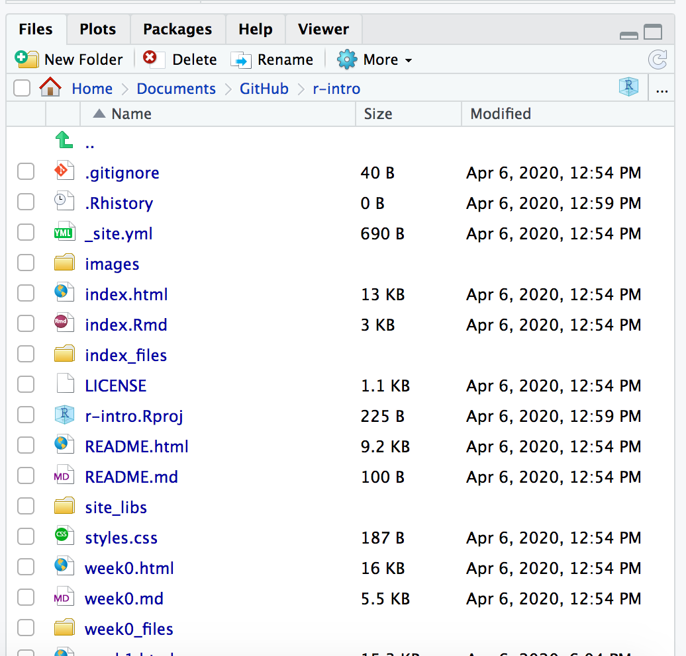

# Session info

`sessionInfo()` display which version of R you are running in which platform and operative system, the locale you are using and the attached packages.

```{r echo=FALSE}
setwd(dir = '/home/cfernandez/git/es_fic_mubics_intro_r/')
```


```{r}
sessionInfo()
```


# Outline

In this introductory course, we review some of the fundamentals of the R language. Topics covered include: 

* Learn about the functions of the various panes in Rstudio
* Introduce the concept of vectors and the types of data that they can hold
* Present the different ways that a user can access documentation in R and when to use them
* Demonstrate the basic format for using an R function
* Teach some simple but useful functions in R

# R basics

R is an open-source, cross-platform, powerful and flexible statistical tool. It allows for a clear visualization of data and results. It's easy to build interactive plots, interactive webs and plots from the code, without other external computer science knowledge. It works by using R scripting facilitating **reproducible Research**.

R packages are collections of functions developed by the community increasing the power of R adding new functionalities or modifying existing ones.

## Support for R

If you need help you can:

- Documentation via `?` or `help.start()`
- Online forums such as [Stack Overflow](http://stackoverflow.com/questions/tagged/r)
- [Blogs](http://www.r-bloggers.com/)
- Documentation for packages is found in RStudio.
- Compulsory documentation (*vignettes*) for each package downloaded from [CRAN](https://cran.r-project.org/)
- Particularly in Bionformatics, Bioconductor is an open source software for bioinformatics. Bioconductor provides training in computational and statistical methods for the analysis of genomic data. [Course & Conferences Materials](http://bioconductor.org/help/course-materials/)

## RStudio

[RStudio](https://www.rstudio.com/products/rstudio/) is an integrated development environment (IDE) for R. RStudio requires a 64-bit operating systems (use older versions if you are on a 32 bit system) and is available **open source**.

Rstudio provides us with a friendly interface to the R statistical progrmming language.
It consists of four main "Panes". These can be re-sized and moved around to suit how
you like to work.

{width=90%}

### Editing pane

By default the top left-hand pane is one for creating, editing & running R scripts.


A script is an R program that you have written. A good practice is for that script to
perform only one role in your analysis workflow and so you may have several R scripts which you call, in a particular sequence, to analyse your data.

As you will see, a script is basically a text file that contains R commands and
(ideally) comments to explain what the codes function is (as a documentation process).

As well as R scripts, there are many types of Rstudio document including Markdown files which we will use in the teaching of this course. These can provide interactive workbooks or pdf and web documents to name but a few possible outcomes.

### Console

Coming down the screen to the bottom left-hand pane we find the console window. This is where we can find output produced by running our R scripts.


We can also try out snippets of R code here. Those of you who have only used graphical interfaces like Windows or MacOS where you click on commands using a mouse may find this aspect of R somewhat different. We type in commands to R using the command line.


### Environment

Next we move to the top right-hand corner pane. Here we have even more tabs (of which we will only consider two Environment and History).


Environment keeps track on R variables which we create (more on those later) and their contents. History is like a tally role of all the R commands we have entered in our session.

### Files, Plots & Help

Our final bottom right-hand pane also has several tabs. The Files tab is a file explorer that enable us to move around our directories and select which files we wish to work on. We can also change the default working directory that Rstudio will use.



The Plots tab is where any graphs that we create in R will appear. We can move through them using the arrow buttons and the export button will convert them to different graphics formats e.g. for publication in a paper or for the web.

The Packages tab shows which R packages are installed (These expand R's functionallity and again will be covered later) and can also install new packages.

The Help tab is a _massively useful_ tab which enables you to search R help index to get help pages on R functions and provide example code to help you use them in your R scripts.


## Typing commands in R

A user can interact with a console just entering R commands (unix console or windows R console) or using the integrate R console in RStudio. Furthermore, RStudio has a history of the commands that the users entered and allows us to write *R scripts* in order to save the sequence for the future (quite interesting!). There are as well other posibilities such as *rmarkdown* but this is for higher R courses (this document is done using *rmakrdown* and kniting it to html from RStudio). Sounds strange? Googleit!!

# Let's R!

At a basic level, we can use R as a calculator to compute simple sums with the `+`, `-`, `*` (for multiplication) and `/` (for division) symbols. 

```{r}
2 + 2
1234 - 234
45 * 33 * 4
5 / 20
```

The answer is displayed at the console with a `[1]` in front of it. The `1` inside the square brackets is a place-holder to signify how many values were in the answer (in this case only one).

In the case of expressions involving multiple operations, R respects the [BODMAS](https://en.wikipedia.org/wiki/Order_of_operations#Mnemonics) system to decide the order in which operations should be performed.

```{r}
1234 - 234 * 4
1234 + (234 * 4)
(1234 + 234) * 4
```

R also has several statistical operations:


```{r}
pi
sin (pi/2)
cos(pi)
tan(2)
log(1)
```

Furthermore, in case we will need to store our results for later use, we need to make use of *variables*.

## Variables

A variable is a letter or word which takes (or contains) a value. We use the assignment 'operator' in R, `<-` to create a variable and store some value in it. We can use the `=` to do this, so... are there any differences? yes, according with John [Chambers](https://developer.r-project.org/equalAssign.html):

*[= assignment is] allowed in only two places in the grammar: at the top level (as a complete program or user-typed expression); and when isolated from surrounding logical structure, by braces or an extra pair of parentheses.*

Check this:

```{r, eval=FALSE}
?Syntax

...
## '=' has lower precedence than '<-' ... so you should not mix them
##     (and '<-' is considered better style anyway):
## Consequently, this gives a ("non-catchable") error
 x <- y = 5  #->  Error in (x <- y) = 5 : ....
```

and this:

```{r, eval=FALSE}
?assignOps

...
The operators <- and = assign into the environment in which they are evaluated. The operator <- can be used anywhere, whereas the operator = is only allowed at the top level (e.g., in the complete expression typed at the command prompt) or as one of the subexpressions in a braced list of expressions.
...
```


```{r}
x <- 1024
x
myAge <- 25
myAge
```

We also can perform arithmetic on variables using functions:

```{r}
sqrt(myAge)
```

We can add variables together:
```{r}
x + myAge
```


We can change the value of an existing variable:

```{r}
x <- 21
x
```

- We can set one variable to equal the value of another variable:

```{r}
x <- myAge
x
```

- We can modify the contents of a variable:

```{r}
myAge <- myAge + sqrt(23)
myAge
```

When we are feeling lazy we might give our variables short names (`x`, `y`, `i`...etc), but a better practice would be to give them meaningful names. There are some restrictions on creating variable names. They cannot start with a number or contain characters such as `.`, `_`, '-'. Naming variables the same as in-built functions in R, such as `c`, `T`, `mean` should also be avoided.

Some [conventions](http://adv-r.had.co.nz/Style.html) exist such as a separating words with `-` or using *c*amel*C*aps. Whatever convention you decided, stick with it!

### Storing more than one value

We are much more likely to want to store a series of data e.g. observation values. Vectors can take any number of values but the assignment statement changes slightly.

```{r}
obs <- c(2, 5, 8, 5, 8, 2)
obs
vulcan <- c(TRUE, FALSE, !TRUE, !FALSE)
vulcan
```

What happens when you ask R to print obs?

__Note__ that with the logical vector we can use the __`!`__ operator to negate (or NOT) a logical i.e. `!TRUE` is equal to `FALSE`.

Calculations can also be included in assignments e.g. we might have a column supplied in one type of units and we need it in another.

```{r}
samples <- 12
new_obs <- obs * 2.2
new_obs
smaller <- samples / 2
smaller
```

__Notice that each and every element of the vector has been multiplied by 2.2__. This is what was happening when we used `1:36 * 2` earlier.

Here are some more arithmetic operators you're likely to come across.

| Symbol | Effect              |
| ------ | ------------------- |
|    +   | Addition            |
|    –   | Subtraction         |
|    *   | Multiplication      |
|    /   | Division            |
|    ^   | Exponent            |
|   %%   | Modulus (Remainder) |
|  %/%   | Integer Division    |

__Note__ that when applying arithmetical functions to vectors they must be appropriate. For example, if you try and add 3 to the character string "a" then R will quite rightly return an error message.

```
> "a" + 3
Error in "a" + 3 : non-numeric argument to binary operator
```

Similarly, we can have long vectors of text strings:

```{r}
animals <- c('cat', 'dog', 'mouse')
drugs <- c('Gefitinib', 'FCR', "Vincristine")
bases <- c("c", "g", "t", "a", "n")
```


## Functions

**Functions** in R perform operations on **arguments** (the inputs(s) to the function). We have already used:

```{r}
sin(x)
```

this returns the sine of x. In this case the function has one argument: **x**. Arguments are always contained in parentheses -- curved brackets, **()** -- separated by commas.


Arguments can be named or unnamed, but if they are unnamed they must be ordered (we will see later how to find the right order). The names of the arguments are determined by the author of the function and can be found in the help page for the function. When testing code, it is easier and safer to name the arguments. `seq` is a function for generating a numeric sequence *from* and *to* particular numbers. Type `?seq` to get the help page for this function.

```{r}
seq(from = 3, to = 20, by = 4)
seq(3, 20, 4)
```

Arguments can have *default* values, meaning we do not need to specify values for these in order to run the function.

`rnorm` is a function that will generate a series of values from a *normal distribution*. In order to use the function, we need to tell R how many values we want

```{r}
## this will produce a random set of numbers, so everyone will get a different set of numbers
rnorm(n=10)
```

The normal distribution is defined by a *mean* (average) and *standard deviation* (spread). However, in the above example we didn't tell R what mean and standard deviation we wanted. So how does R know what to do? All arguments to a function and their default values are listed in the help page

```{r}
?rnorm
```

In this case, we see that the defaults for mean and standard deviation are 0 and 1. We can change the function to generate values from a distribution with a different mean and standard deviation using the `mean` and `sd` *arguments*. It is important that we get the spelling of these arguments exactly right, otherwise R will an error message, or (worse?) do something unexpected.

```{r}
rnorm(n=10, mean=2,sd=3)
rnorm(10, 2, 3)
```

In the examples above, `seq` and `rnorm` were both outputting a series of numbers, which is called a *vector* in R and is the most-fundamental data-type.

### Our first  R function – help

Functions are like mathematical functions they take argument(s) and return a result and the arguments are enclosed in brackets i.e. $Y = F(X)$

They extend the capabilities of R. A function that you will find most ‘helpful’ is the help() function. It provides help on the topic that is supplied as the argument.

Try

```{r}
help(help)
```

The result appears in the bottom right-hand pane.

Notice how Rstudio tries to help you by suggesting what the arguments could be (in floating yellow text box).
_Need more help?_ You can also use ?<command> i.e. `?help`.

If you know roughly what you need but not the actual function name use `??` e.g. `??average`.

What if you know the function name but can't recall what the arguments are?
Try `args()` function e.g. `args(plot.default)`.

#### More useful functions

__`length()`__ to find out how many elements are in a vector

```{r}
length(animals)
```

__`class()`__ will tell you the class (suprise) of a vector e.g. character or numeric

```{r}
class(animals)
class(obs)
```

__`str()`__ reports the structure of an object. This terse report includes such useful information as class, index range of elements e.g. 1..n and the values contained therein. The same output can be seen for each object in
the Environment pane in the top right-hand pane.

```{r}
str(obs)
```

__`typeof()`__ - reports how object is stored e.g. character, integer, double or logical.  If we explicitly want a vector to be integer-only we can use another function __`as.integer()`__ or a suffix of __`L`__ when we assign it (see below).

```{r}
?typeof
samples
typeof(samples)
hint <- 5L
hint2 <- as.integer(25)
hint
typeof(hint)
hint2
typeof(hint2)
drug <- "Gefitinib"
typeof(drug)
```

So what does R mean by these types and why would we use one over another? What does R have to tell us on this topic?

```{r}
?integer
```

```{r}
?double
```

```{r}
?character
```

__Integer__ - whole discrete numbers e.g. numbers of mice, cell counts.

__Double__ - continuous decimal values e.g. specific activity or a voltage reading.

__Character__ - A string of one to N alphanumeric characters e.g. a drug name.

__Factor__ - A new one. Categorical values that may or may not have any heirachical order e.g. drug1, drug2, drug3. We would use these to seperate data e.g. when plotting. More about factors later in the course.

Computational aspects of these types relate to space required to store the value (number of bytes) and speed at accessing the value. Order of lowest to highest is typically: integer, double and character. However, unless you are dealing with huge quantities of data or lots of processing, this is unlikely to affect your programs.

__Important__ - you can only store one type of data in any one vector i.e. all logical or all character etc. If you mix them, R will store them in the lowest common denominator of type in order to preserve as much information as possible about the value.

__`summary()`__ -  one of my __favourite__ functions. R gives an object summary of the vector. this means that what is returned depends on the vector. I often use it on data after I have read it in from a file to do a 'sanity check' and find maximum and minimum values etc to spot unexpected (and possibly erroneous) values.

```{r}
summary(obs)
```

So-called 'Base' R does possess plotting functions. However, later lessons will teach you how to plot using a much more powerful and easy-to-use _tidyverse_ package called _ggplot2_.

Just to demonstrate a function with multiple parameters, I will use base R plot here. Once you have read in your data you may wish to do a quick & dirty plot it e.g. to spot any trends or outliers. This can be done quickly in R (but much finer control in ggplot2).

```{r scatter_plot}
 X <- c(1,2,3,4,5)
 Y <- c(9, 17, 23, 38, 52)
 plot.default(X, Y, pch = 4, col = "red")
```

__A point to note here__ - In the help you will notice that parameters are usually presented in a specific order in the brackets. This will work fine, but you may wish to take default values or enter parameters out of order.
You can do this by using a parameter name e.g. the plot character is called 'pch' and we can put `pch = N` anywhere between the brackets.
However, just because you can is not a good reason. Doing things out of order for no reason can make your code less readable.


## Vectors

- The basic data structure in R is a **vector** -- an ordered collection of values. 
- R treats even single values as 1-element vectors. 
- The function `c` *combines* its arguments into a vector:
- As `c` is a function, we specify it's arguments in curved brackets`(...)`

```{r}
x <- c(3,4,5,6)
x
```


The `seq` function we saw before was another example of how to create a sequence of values. A useful shortcut is to use the `:` symbol. 

```{r}
x <- 3:6
x
```


The square brackets `[]` indicate the position within the vector (the ***index***). We can extract individual elements by using the `[]` notation:

```{r}
x[1]
x[4]
```

We can even put a vector inside the square brackets: (*vector indexing*)


When applying all standard arithmetic operations to vectors, application is element-wise. Thus, we say that R supports *vectorised* operations.

```{r}
x <- 1:10
y <- x*2
y
z <- x^2

x + y
```

Vectorised operations are extremely powerful. Operations that would require a *for* loop (or similar) in other languages such as **C**, **Python**, can be performed in a single line of R code.

A vector can also contain text; called a character vector. Such a vector can also be constructed using the `c` function. 

```{r}
x <- c("A","B","C","D")
```

The quote marks are crucial. Why?

```{r eval=FALSE}
##try and ignore the eval=FALSE on the line above...we'll explain what this means later
x <- c(A, B, C, D)
```

Another useful type of data that we will see is the *logical* or *boolean* which can take either the values of `TRUE` or `FALSE`

```{r}
x <- c(TRUE,TRUE,FALSE)
```

Logical values are useful when we want to create subsets of our data. We can use *comparison* operators; `==`, `>`, `<`, `!=` to check if values are equal, greater than, less than, or not equal.

```{r}
x <- c("A","A", "B","B","C")
x == "A"
x != "A"
x <- rnorm(10)
x > 0
```

However, all items in the vector **must** be the same type. If you attempt anything else, R will convert all values to the same (most basic) type.

```{r}
x <- c(1, 2, "three")
x
```


# Summary

In this course we have covered the following concepts:

* The Rstudio environment and the functions associated with each pane
* Using the RStudio console as a calculator and place to test out R code
* Storing a single item of data in an R vector
* Storing multiple items of data in an R vector
* Arithmetic operators and applying them to R vectors
* Calling functions in R
* Many different ways of getting help within R
* Learning about the different types of vector in R (integer, double, character)
* Further details on how we can supply parameters to an R function
