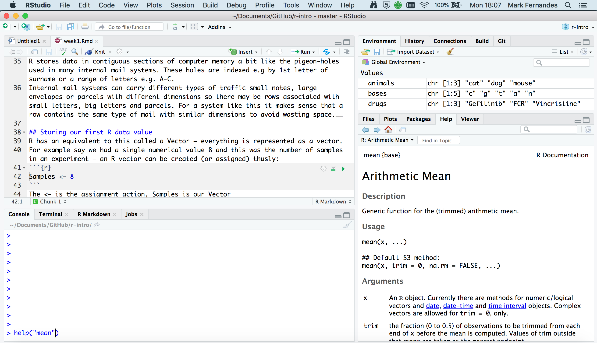
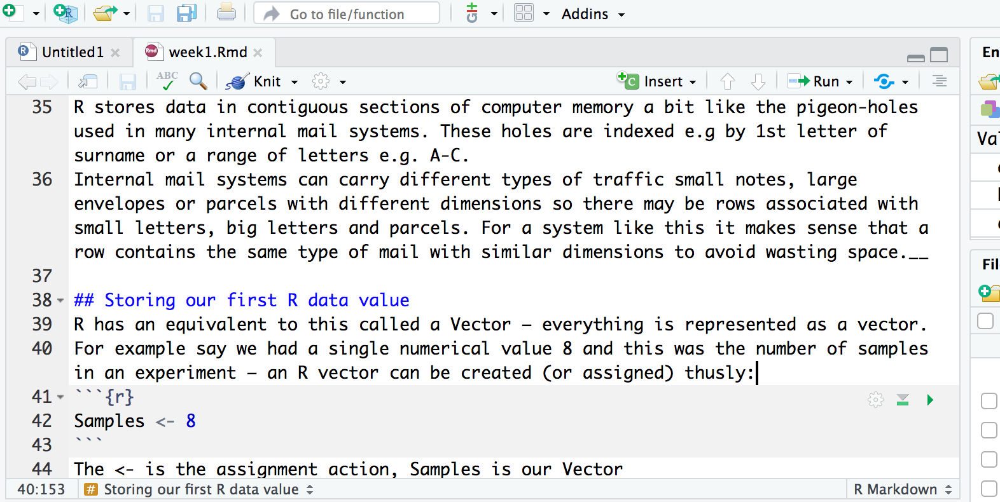
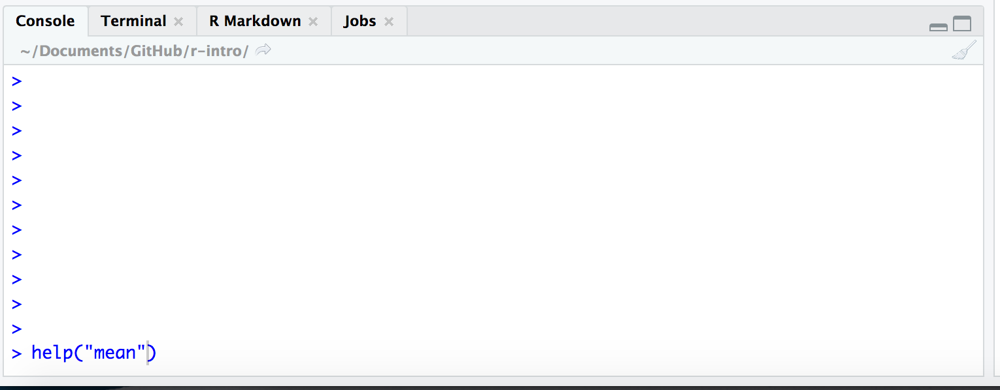
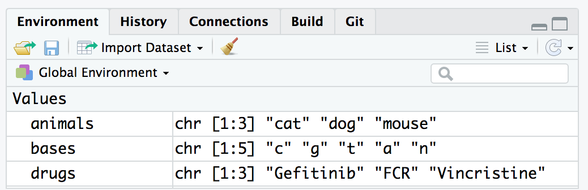

# Session info

`sessionInfo()` display which version of R you are running in which platform and operative system, the locale you are using and the attached packages.

```{r echo=FALSE}
setwd(dir = '/home/cfernandez/git/es_fic_mubics_intro_r/')
```


```{r}
sessionInfo()
```


# Outline

In this introductory course, we review some of the fundamentals of the R language. Topics covered include: 

* Learn about the functions of the various panes in Rstudio
* Introduce the concept of vectors and the types of data that they can hold
* Present the different ways that a user can access documentation in R and when to use them
* Demonstrate the basic format for using an R function
* Teach some simple but useful functions in R

# R basics

R is an open-source, cross-platform, powerful and flexible statistical tool. It allows for a clear visualization of data and results. It's easy to build interactive plots, interactive webs and plots from the code, without other external computer science knowledge. It works by using R scripting facilitating **reproducible Research**.

R packages are collections of functions developed by the community increasing the power of R adding new functionalities or modifying existing ones.

## Support for R

If you need help you can:

- Documentation via `?` or `help.start()`
- Online forums such as [Stack Overflow](http://stackoverflow.com/questions/tagged/r)
- [Blogs](http://www.r-bloggers.com/)
- Documentation for packages is found in RStudio.
- Compulsory documentation (*vignettes*) for each package downloaded from [CRAN](https://cran.r-project.org/)
- Particularly in Bionformatics, Bioconductor is an open source software for bioinformatics. Bioconductor provides training in computational and statistical methods for the analysis of genomic data. [Course & Conferences Materials](http://bioconductor.org/help/course-materials/)

## RStudio

[RStudio](https://www.rstudio.com/products/rstudio/) is an integrated development environment (IDE) for R. RStudio requires a 64-bit operating systems (use older versions if you are on a 32 bit system) and is available **open source**.

Rstudio provides us with a friendly interface to the R statistical programming language.
It consists of four main "Panes". These can be re-sized and moved around to suit how
you like to work.



### Editing pane

By default the top left-hand pane is one for creating, editing & running R scripts.



A script is an R program that you have written. A good practice is for that script to
perform only one role in your analysis workflow and so you may have several R scripts which you call, in a particular sequence, to analyse your data.

As you will see, a script is basically a text file that contains R commands and
(ideally) comments to explain what the codes function is (as a documentation process).

As well as R scripts, there are many types of Rstudio document including Markdown files which we will use in the teaching of this course. These can provide interactive workbooks or pdf and web documents to name but a few possible outcomes.

### Console

Coming down the screen to the bottom left-hand pane we find the console window. This is where we can find output produced by running our R scripts.



We can also try out snippets of R code here. Those of you who have only used graphical interfaces like Windows or MacOS where you click on commands using a mouse may find this aspect of R somewhat different. We type in commands to R using the command line.


### Environment

Next we move to the top right-hand corner pane. Here we have even more tabs (of which we will only consider two Environment and History).



Environment keeps track on R variables which we create (more on those later) and their contents. History is like a tally role of all the R commands we have entered in our session.

### Files, Plots & Help

Our final bottom right-hand pane also has several tabs. The Files tab is a file explorer that enable us to move around our directories and select which files we wish to work on. We can also change the default working directory that Rstudio will use.


The Plots tab is where any graphs that we create in R will appear. We can move through them using the arrow buttons and the export button will convert them to different graphics formats e.g. for publication in a paper or for the web.

The Packages tab shows which R packages are installed (These expand R's functionallity and again will be covered later) and can also install new packages.

The Help tab is a _massively useful_ tab which enables you to search R help index to get help pages on R functions and provide example code to help you use them in your R scripts.


## Typing commands in R

A user can interact with a console just entering R commands (unix console or windows R console) or using the integrate R console in RStudio. Furthermore, RStudio has a history of the commands that the users entered and allows us to write *R scripts* in order to save the sequence for the future (quite interesting!). There are as well other posibilities such as *rmarkdown* but this is for higher R courses (this document is done using *rmakrdown* and kniting it to html from RStudio). Sounds strange? Googleit!!

# Let's R!

At a basic level, we can use R as a calculator to compute simple sums with the `+`, `-`, `*` (for multiplication) and `/` (for division) symbols. 

```{r}
2 + 2
1234 - 234
45 * 33 * 4
5 / 20
```

The answer is displayed at the console with a `[1]` in front of it. The `1` inside the square brackets is a place-holder to signify how many values were in the answer (in this case only one).

In the case of expressions involving multiple operations, R respects the [BODMAS](https://en.wikipedia.org/wiki/Order_of_operations#Mnemonics) system to decide the order in which operations should be performed.

```{r}
1234 - 234 * 4
1234 + (234 * 4)
(1234 + 234) * 4
```

R also has several statistical operations:


```{r}
pi
sin (pi/2)
cos(pi)
tan(2)
log(1)
```

Here are some more arithmetic operators you're likely to come across.

| Symbol | Effect              |
| ------ | ------------------- |
|    +   | Addition            |
|    –   | Subtraction         |
|    *   | Multiplication      |
|    /   | Division            |
|    ^   | Exponent            |
|   %%   | Modulus (Remainder) |
|  %/%   | Integer Division    |

__Note__ that when applying arithmetical functions to vectors they must be appropriate. For example, if you try and add 3 to the character string "a" then R will quite rightly return an error message.


Furthermore, in case we will need to store our results for later use, we need to make use of *variables*.

## Variables

A variable is a letter or word which takes (or contains) a value. We use the assignment 'operator' in R, `<-` to create a variable and store some value in it. We can use the `=` to do this, so... are there any differences? yes, according with John [Chambers](https://developer.r-project.org/equalAssign.html):

*[= assignment is] allowed in only two places in the grammar: at the top level (as a complete program or user-typed expression); and when isolated from surrounding logical structure, by braces or an extra pair of parentheses.*

Check this:

```{r, eval=FALSE}
?Syntax

...
## '=' has lower precedence than '<-' ... so you should not mix them
##     (and '<-' is considered better style anyway):
## Consequently, this gives a ("non-catchable") error
 x <- y = 5  #->  Error in (x <- y) = 5 : ....
```

and this:

```{r, eval=FALSE}
?assignOps

...
The operators <- and = assign into the environment in which they are evaluated. The operator <- can be used anywhere, whereas the operator = is only allowed at the top level (e.g., in the complete expression typed at the command prompt) or as one of the subexpressions in a braced list of expressions.
...
```


```{r}
x <- 1024
x
myAge <- 25
myAge
```

We also can perform arithmetic on variables using functions:

```{r}
sqrt(myAge)
```

We can add variables together:
```{r}
x + myAge
```


We can change the value of an existing variable:

```{r}
x <- 21
x
```

- We can set one variable to equal the value of another variable:

```{r}
x <- myAge
x
```

- We can modify the contents of a variable:

```{r}
myAge <- myAge + sqrt(23)
myAge
```

When we are feeling lazy we might give our variables short names (`x`, `y`, `i`...etc), but a better practice would be to give them meaningful names. There are some restrictions on creating variable names. They cannot start with a number or contain characters such as `.`, `_`, '-'. Naming variables the same as in-built functions in R, such as `c`, `T`, `mean` should also be avoided.

Some [conventions](http://adv-r.had.co.nz/Style.html) exist such as a separating words with `-` or using *c*amel*C*aps. Whatever convention you decided, stick with it!

### Storing more than one value

We are much more likely to want to store a series of data e.g. observation values. Vectors can take any number of values but the assignment statement changes slightly.

```{r}
obs <- c(2, 5, 8, 5, 8, 2)
obs
vulcan <- c(TRUE, FALSE, !TRUE, !FALSE)
vulcan
```

What happens when you ask R to print obs?

__Note__ that with the logical vector we can use the __`!`__ operator to negate (or NOT) a logical i.e. `!TRUE` is equal to `FALSE`.

Calculations can also be included in assignments e.g. we might have a column supplied in one type of units and we need it in another.

```{r}
samples <- 12
new_obs <- obs * 2.2
new_obs
smaller <- samples / 2
smaller
```

__Notice that each and every element of the vector has been multiplied by 2.2__. This is what was happening when we used `1:36 * 2` earlier.

```
> "a" + 3
Error in "a" + 3 : non-numeric argument to binary operator
```

Similarly, we can have long vectors of text strings:

```{r}
animals <- c('cat', 'dog', 'mouse')
drugs <- c('Gefitinib', 'FCR', "Vincristine")
bases <- c("c", "g", "t", "a", "n")
```


## Functions

**Functions** in R perform operations on **arguments** (the inputs(s) to the function). We have already used:

```{r}
sin(x)
```

this returns the sine of x. In this case the function has one argument: **x**. Arguments are always contained in parentheses -- curved brackets, **()** -- separated by commas.


Arguments can be named or unnamed, but if they are unnamed they must be ordered (we will see later how to find the right order). The names of the arguments are determined by the author of the function and can be found in the help page for the function. When testing code, it is easier and safer to name the arguments. `seq` is a function for generating a numeric sequence *from* and *to* particular numbers. Type `?seq` to get the help page for this function.

```{r}
seq(from = 3, to = 20, by = 4)
seq(3, 20, 4)
```

Arguments can have *default* values, meaning we do not need to specify values for these in order to run the function.

`rnorm` is a function that will generate a series of values from a *normal distribution*. In order to use the function, we need to tell R how many values we want

```{r}
## this will produce a random set of numbers, so everyone will get a different set of numbers
rnorm(n=10)
```

The normal distribution is defined by a *mean* (average) and *standard deviation* (spread). However, in the above example we didn't tell R what mean and standard deviation we wanted. So how does R know what to do? All arguments to a function and their default values are listed in the help page

```{r}
?rnorm
```

In this case, we see that the defaults for mean and standard deviation are 0 and 1. We can change the function to generate values from a distribution with a different mean and standard deviation using the `mean` and `sd` *arguments*. It is important that we get the spelling of these arguments exactly right, otherwise R will an error message, or (worse?) do something unexpected.

```{r}
rnorm(n=10, mean=2, sd=3)
rnorm(10, 2, 3)
```

In the examples above, `seq` and `rnorm` were both outputting a series of numbers, which is called a *vector* in R and is the most-fundamental data-type.

### Our first  R function – help

Functions are like mathematical functions they take argument(s) and return a result and the arguments are enclosed in brackets i.e. $Y = F(X)$

They extend the capabilities of R. A function that you will find most ‘helpful’ is the help() function. It provides help on the topic that is supplied as the argument.

Try

```{r}
help(help)
```

The result appears in the bottom right-hand pane.

Notice how Rstudio tries to help you by suggesting what the arguments could be (in floating yellow text box).
_Need more help?_ You can also use ?<command> i.e. `?help`.

If you know roughly what you need but not the actual function name use `??` e.g. `??average`.

What if you know the function name but can't recall what the arguments are?
Try `args()` function e.g. `args(plot.default)`.

#### More useful functions

__`length()`__ - to find out how many elements are in a vector

```{r}
length(animals)
```

__`class()`__ - will tell you the class (suprise) of a vector e.g. character or numeric

```{r}
class(animals)
class(obs)
```

__`str()`__ - reports the structure of an object. This terse report includes such useful information as class, index range of elements e.g. 1..n and the values contained therein. The same output can be seen for each object in
the Environment pane in the top right-hand pane.

```{r}
str(obs)
```

__`typeof()`__ - reports how object is stored e.g. character, integer, double or logical.  If we explicitly want a vector to be integer-only we can use another function __`as.integer()`__ or a suffix of __`L`__ when we assign it (see below).

```{r}
?typeof
samples
typeof(samples)
hint <- 5L
hint2 <- as.integer(25)
hint
typeof(hint)
hint2
typeof(hint2)
drug <- "Gefitinib"
typeof(drug)
```

So what does R mean by these types and why would we use one over another? What does R have to tell us on this topic?

```{r}
?integer
```

```{r}
?double
```

```{r}
?character
```

__Integer__ - whole discrete numbers e.g. numbers of mice, cell counts.

__Double__ - continuous decimal values e.g. specific activity or a voltage reading.

__Character__ - A string of one to N alphanumeric characters e.g. a drug name.

__Factor__ - A new one. Categorical values that may or may not have any heirachical order e.g. drug1, drug2, drug3. We would use these to seperate data e.g. when plotting. More about factors later in the course.

Computational aspects of these types relate to space required to store the value (number of bytes) and speed at accessing the value. Order of lowest to highest is typically: integer, double and character. However, unless you are dealing with huge quantities of data or lots of processing, this is unlikely to affect your programs.

__Important__ - you can only store one type of data in any one vector i.e. all logical or all character etc. If you mix them, R will store them in the lowest common denominator of type in order to preserve as much information as possible about the value.

__`summary()`__ - R gives an object summary of the vector. this means that what is returned depends on the vector. I often use it on data after I have read it in from a file to do a 'sanity check' and find maximum and minimum values etc to spot unexpected (and possibly erroneous) values.

```{r}
summary(obs)
```

So-called 'Base' R does possess plotting functions. However, later lessons will teach you how to plot using a much more powerful and easy-to-use _tidyverse_ package called _ggplot2_.

Just to demonstrate a function with multiple parameters, I will use base R plot here. Once you have read in your data you may wish to do a quick & dirty plot it e.g. to spot any trends or outliers. This can be done quickly in R (but much finer control in ggplot2).

```{r scatter_plot}
 X <- c(1,2,3,4,5)
 Y <- c(9, 17, 23, 38, 52)
 plot.default(X, Y, pch = 4, col = "red")
```

__A point to note here__ - In the help you will notice that parameters are usually presented in a specific order in the brackets. This will work fine, but you may wish to take default values or enter parameters out of order.
You can do this by using a parameter name e.g. the plot character is called 'pch' and we can put `pch = N` anywhere between the brackets.
However, just because you can is not a good reason. Doing things out of order for no reason can make your code less readable.


## Vectors

- The basic data structure in R is a **vector** -- an ordered collection of values. 
- R treats even single values as 1-element vectors. 
- The function `c` *combines* its arguments into a vector:
- As `c` is a function, we specify it's arguments in curved brackets`(...)`

```{r}
x <- c(3,4,5,6)
x
```


The `seq` function we saw before was another example of how to create a sequence of values. A useful shortcut is to use the `:` symbol. 

```{r}
x <- 3:6
x
```


The square brackets `[]` indicate the position within the vector (the ***index***). We can extract individual elements by using the `[]` notation:

```{r}
x[1]
x[4]
```

We can even put a vector inside the square brackets: (*vector indexing*)


When applying all standard arithmetic operations to vectors, application is element-wise. Thus, we say that R supports *vectorised* operations.

```{r}
x <- 1:10
y <- x*2
y
z <- x^2

x + y
```

Vectorised operations are extremely powerful. Operations that would require a *for* loop (or similar) in other languages such as **C**, **Python**, can be performed in a single line of R code.

A vector can also contain text; called a character vector. Such a vector can also be constructed using the `c` function. 

```{r}
x <- c("A","B","C","D")
```

The quote marks are crucial. Why?

```{r eval=FALSE}
##try and ignore the eval=FALSE on the line above...we'll explain what this means later
x <- c(A, B, C, D)
```

Another useful type of data that we will see is the *logical* or *boolean* which can take either the values of `TRUE` or `FALSE`

```{r}
x <- c(TRUE,TRUE,FALSE)
```

Logical values are useful when we want to create subsets of our data. We can use *comparison* operators; `==`, `>`, `<`, `!=` to check if values are equal, greater than, less than, or not equal.

```{r}
x <- c("A","A", "B","B","C")
x == "A"
x != "A"
x <- rnorm(10)
x > 0
```

However, all items in the vector **must** be the same type. If you attempt anything else, R will convert all values to the same (most basic) type.

```{r}
x <- c(1, 2, "three")
x
```


Let's start with fundamentals of the R language looking at some aspects of R that are crucial to understanding how R is handling your data. We will also start to look at the most important data structure you'll use with your data, assuming it is in tabular form, the **data frame**.

---

# Scripts

Up to now, we were mostly typing code in the Console pane at the **`>`** prompt.
This is a very interactive way of working with R but what if you want to save
the commands you've typed for a future session working in R?

Instead we can create a script file containing our R commands that we can come
back to later. This is the way most R coding is done so let's have a go.

From the RStudio '**File**' menu, select '**New File**' and then '**R Script**'.

{width=50%}

You should now have a new file at the top of the left-hand side of RStudio for
your new R script named 'Untitled1'. The Console window no longer occupies the
whole of the left-hand side.

{width=100%}

We can type code into this file just as we have done in the Console window at
the command prompt.

Type in some commands. Do you notice that the
file name on the tab for this pane is now highlighted in red and has an
asterisk?

{width=50%}

This tells us that we haven't yet saved our changes. There are various ways to
do so just like in Word or Excel or other applications you're familiar with, for
example using the '**Save**' option from the '**File**' menu or clicking on the
'**Save**' button.

My preference by far is to use a keyboard shortcut. On a Mac this would be
<kbd>cmd</kbd> + <kbd>S</kbd> (press the <kbd>cmd</kbd> key first and, while
keeping this depressed, click the <kbd>S</kbd> key); on Windows you would do the
same thing using <kbd>Ctrl</kbd> + <kbd>S</kbd>.

If the file already exists it will be saved without any further ado. As this is
a new file, RStudio needs to know what you want to call it and in which folder
on your computer you want it to be saved. You can choose the file name and
location using the file dialog that appears. RStudio will add a '.R' suffix if
you don't specify one.

## Running scripts

Having typed an R command and hit the return key you'll notice that the
command isn't actually run like it was in the console window. That's because
you're writing your R code in an editor. To run a single line of code within
your script you can press the '**Run**' button at the top of the script.


This will run the line of code on which the cursor is flashing or the next line
of code if the cursor is on a blank or empty line.

The keyboard shortcut is more convenient in practice as you won't have to stop
typing at the keyboard to use your mouse. This is <kbd>cmd</kbd> +
<kbd>return</kbd> on a Mac and <kbd>Ctrl</kbd> + <kbd>enter</kbd> on Windows.

Running a line in your script will automatically move the cursor onto the
next command which can be very convenient as you'll be able to run successive
commands just by repeatedly clicking '**Run**' or using the keyboard shortcut.

You can also run the entire script by clicking on the '**Source**' button, a
little to the right of the '**Run**' button. More useful though is to run 
'**Source with Echo**' from the Source drop-down menu as this will also display
your commands and the outputs from these in the Console window.

## Adding comments to scripts

It is a very good idea to add comments to your code to explain what it's doing
or what you intended. This will help others to understand your code and more
than likely even yourself when you come to revisit it a few weeks or months
later.

Anything following a **`#`** symbol is a comment that R will ignore. Here's an
example of adding comments to our simple script.


Comments usually appear at the beginning of lines but can appear at the end of
an R statement.

```{r}
days <- c(1, 2, 4, 6, 8, 12, 16) # didn't manage to get a measurement on day 10
```

It is also quite common when looking at R code to see lines of code commented
out, usually replaced by another line that does something similar or makes a
small change.

```{r}
# random_numbers <- rnorm(100, mean = 0, sd = 1)
random_numbers <- rnorm(100, mean = 0, sd = 0.5)
```


# Vectors

We introduced **vectors**, the simplest type of data structure in R.
An atomic vector is a collection of values or things of the same type in a given
order. We created some last week using **`c()`** and the **`:`** operator.

```{r}
some_numbers <- 1:10
days_of_the_week <- c("Sunday", "Monday", "Tuesday", "Wednesday", "Thursday", "Friday", "Saturday")
```

In the first example, an integer vector was created with 10 values from 1 to 10.
`some_numbers` is a name that refers to the vector and can be used in other R
statements while `1:10` is the vector object itself.

A single value is known as a **scalar**. R doesn't treat this single value any differently;
it is still a vector, just one that has a length of 1.

```{r}
length(days_of_the_week)
length(samples)
```

Almost every object in R is a vector of one kind or another, or is constructed
of vectors, so it's really important to understand these well.

```{block type = "rmdblock"}
**`length()`**
The `length()` function returns the number of elements in a vector.
`length(8:15)`
```

## Combining vectors

The other way we've encountered for creating a vector is to use **`c()`**. This
is actually a function and we can get help for it just as we can for any other
function.

```{r eval = FALSE}
?c
```

From the help page you can see that `c` stands for 'combine' (or perhaps
'concatenate' as both terms are used in the documentation).

One of the most useful things about the help pages for functions are the
examples that are given -- you'll need to scroll down to the bottom of the help
page to see them. These can be really helpful in demonstrating how a function
works. You can very easily cut and paste these examples and run these in the
console window as a way of experimenting with and learning about the function.

Let's have a look at the first example from the help page for `c()`. It's
slighly more complicated than what we did last week.

```{r}
c(1, 7:9)
```

This is actually combining two vectors, the first with a single value `1`
and the second with values `7`, `8` and `9`. Here's another example:

```{r}
cats <- c("felix", "kitty", "tigger")
dogs <- c("spot", "snoopy")
cats_and_dogs <- c(cats, dogs)
cats_and_dogs
```

```{block type = "rmdblock"}
**`c()`**
The `c()` function is a generic function that combines its arguments, i.e. the
things you pass to the function by including these within the parentheses, `()`.
You can pass as many vectors as you like to `c()` and it will concatenate these
into a single vector.
Arguments will be coerced to a common type.
`c(1:5, 10.5, "next")`
```

## Coercion

Atomic vectors must contain values that are all of the same type. A bit later
on, we'll introduce another type of data structure that doesn't have this
restriction -- the list. First though, a look at back at one of the exercises
from last week's assignment in which we tried to create vectors of things
that are of different types.

```{r}
integer_logical <- c(1:5, c(TRUE, FALSE, TRUE))
integer_logical
typeof(integer_logical)
```

Combining an integer vector, `1:5`, containing the numbers 1 through 5, with a
logical vector results in an integer vector. The logical values have been
*'coerced'* into integers. But why the logical values and not the integers to
produce a logical vector?

If you think about it, it makes more sense to convert logical values where
`TRUE` and `FALSE` are usually represented in computers by the bits `1` and `0`
respectively. `TRUE` and `FALSE` have natural and understandable equivalents in
the world of integers. Which logical value would you give to the number 5 for
example?

Similarly, integers get converted to doubles in this example:

```{r}
integer_double <- c(3.4, 7, 2.3, 6:-3)
integer_double
typeof(integer_double)
```

Again, this makes more sense than converting doubles (numbers with a decimal
point) to integers (whole numbers) and losing some of their precision.

Finally, it is really not obvious how to convert most character strings into
either logical or numeric values, so when combining vectors that contain
characters everything else gets 'coerced' into becoming characters.

```{r}
we_all_want_to_be_characters <- c(FALSE, 1:5, 23L, 3.23, 5.2e4, 1e-6, "matt")
we_all_want_to_be_characters
typeof(we_all_want_to_be_characters)
```

## Extracting subsets

One of the operations we do frequently on our data is to select subsets that
are of particular interest. For example, we may be interested in the top 50
genes in a differential expression analysis for our RNA-seq experiment where
those genes of interest are the ones with a log fold change above a certain
value and with a *p*-value below 0.01.

Having a good understanding of how to select a subset of values from a vector
is going to be invaluable when we come to do the same for more complicated
data structures so let's take a look.

The main subsetting operator we'll use is the square bracket, **`[]`**. Here's an
example.

```{r}
log2fc <- c(2.3, -1, 0.48, 0.97, -0.02, 1.23)
log2fc[3]
```

We have a vector of six log~2~ fold change values and we've chosen to select
the third value.

If you're familiar with other programming languages you will notice that the
indexing scheme in R starts from 1, not 0. So the first element in the vector
is referred to using the index 1, i.e. `log2fc[1]`.

Multiple values can be extracted by providing a vector of indices, e.g.

```{r}
log2fc[c(2, 4, 5)]
```

You can also extract elements in a different order, e.g.

```{r}
log2fc[c(2, 5, 4)]
```

It is possible to exclude values instead by providing negative indices, e.g. to
exclude the second element:

```{r}
log2fc[-2]
```

Or to exclude multiple elements:

```{r}
log2fc[-c(2, 3)]
```

Finally, we can also subset our vector using a vector of logical values.

```{r}
log2fc[c(TRUE, FALSE, TRUE, TRUE, FALSE, FALSE)]
```

```{block type = "rmdblock"}
**Parentheses `()` and brackets `[]`**
Remember to use **`()`** for **functions** and **`[]`** for **subsetting**.
`my_vector <- c(1, 7:9)`
`my_vector[2]`
```

### Conditional subsetting

You may be thinking that the last example in which we extracted a subset using
logical values seems very abstract and why on earth it could possibly be useful.
But actually, it is probably the most frequently used way of selecting values of
interest. To understand why, we'll need to introduce the concept of logical
operators.

Let's say we're interested in just the log~2~ fold changes that are above a
threshold of 0.5. We can test each of the values using the **`>`** logical
operator.

```{r}
log2fc > 0.5
```

This results in a logical vector containing `TRUE` and `FALSE` values for each
element. The values at positions 1, 4 and 6 in our vector are above the
threshold so result in `TRUE`, the others result in `FALSE`.

We can use this resulting vector to subset our original `log2fc` vector.

```{r}
above_threshold <- log2fc > 0.5
log2fc[above_threshold]
```

In practice, we wouldn't really create a variable containing our logical vector
signifying whether values are of interest. Instead we'd do this in a single
step.

```{r}
log2fc[log2fc > 0.5]
```

However, in a real R script, we might not want to hard-wire the threshold of 0.5
but instead let the user specify this each time the script is run, e.g. by
passing in the value as a command-line argument. If we have a variable storing
the desired threshold value, e.g. `log2fc_threshold`, then we would write the
above as follows.

```{r}
log2fc_threshold <- 0.5
log2fc_above_threshold <- log2fc[log2fc > log2fc_threshold]
log2fc_above_threshold
```

We also captured the result in another vector called `log2fc_above_threshold`
although we could have overwritten our original log2fc if we wanted to by
assigning the result back to log2fc.

```{r}
log2fc <- log2fc[log2fc > log2fc_threshold]
```

You can combine two or more conditions using **`&`** if you want both conditions
to be true or using **`|`** if either of the conditions holds.

```{r}
# reset our log2fc vector to how it was originally
log2fc <- c(2.3, -1, 0.48, 0.97, -0.02, 1.23)
# find small fold changes
log2fc[log2fc < 0.5 & log2fc > -0.5]
```

```{r}
# find large fold changes
log2fc[log2fc > 1 | log2fc < -1]
```

`&` and `|` are the R versions of the AND and OR operations in Boolean algebra
but applied to vectors.

### Logical operators

The following table lists the logical operators you can use in R.

| Operator | Description              |
| -------- | ------------------------ |
|   < 	   | less than                |
|   <=     | less than or equal to    |
|   > 	   | greater than             |
|   >= 	   | greater than or equal to |
|   == 	   | exactly equal to         |
|   != 	   | not equal to             |
|   !x     | NOT x                    |
| x \| y 	 | x OR y                   |
| x & y    | x AND y                  |

`x` and `y` in the last 3 of these operators are intended for logical values; if
you apply them to other types, those other types will be coerced to logicals in
exactly the same way we saw earlier.

## Modifying subsets

All subsetting operations can be combined with assignment. So we can modify or
overwrite the values at specified position in our vector.

```{r}
some_numbers <- 1:10
some_numbers[c(2, 4, 8)] <- c(150, 34, -10)
some_numbers
```

And, as before, we could use a condition to decide which values to change. For
example, you may decide that log~2~ fold changes above 1 are somewhat unreliable
with your detection method and so you'd like to put a cap on any values above
this limit.

```{r}
log2fc[log2fc > 1] <- 1
log2fc
```

## Vector arithmetic

Many operations in R are **vectorized**, which means that the operation is
applied to an entire set of values at once. We've already seen lots of examples
of this, like the following:

```{r}
some_numbers <- 1:10
square_numbers <- some_numbers ^ 2
square_numbers
```

Here we used the **`^`** exponent operator to raise our numbers to the power of
2. This happened in a single operation, i.e. just one line of code. In other
computer languages we might have had to write what is known as a loop in order
to iterate over and perform the calculation for each value in turn.

Another way of writing the above statement to get the same result would be to
multiply our numbers by themselves.

```{r}
square_numbers <- some_numbers * some_numbers
square_numbers
```

What actually happened here was slightly different though. Two vectors
(actually the same vector in this case) of the same length were multiplied
together. R did this **_element-by-element_**, which means that the first
element from the first vector was multiplied by the first element of the second
vector. Likewise, the second elements from each vector were multiplied by each
other and so on.

Here's another example that we will also show diagrammatically.

```{r}
a <- 1:6
b <- c(3.2, 0.4, 1.6, 0.5, 1.3, 0.1)
a * b
```


Usually vector arithmetic involves two vectors of the same length or involves
a vector and a scalar (a vector of length 1). One of the first examples from
last week was the second scenario involving a vector and a single value.

```{r}
1:36 * 2
```


# Combining data of different types

Vectors are all very well and good but your data are almost certainly more
complicated than an ordered set of values all of the same type. You've probably
been working with Excel spreadsheets that contain some columns that are
numerical while others contain names or character strings, e.g. the following
table of Star Wars characters.

```{r echo = FALSE, message = FALSE}
DT::datatable(dplyr::select(dplyr::starwars, name, height, mass, gender, species, homeworld), rownames = FALSE)
```

Note that the first column contains character type data, the second and third
columns contain numerical data (of type double) and the remaining columns
contain the special type we briefly touched on last week, factors, that look
like character types but have a limited set of values or categories.

## Lists

R's simplest structure that combines data of different types is a **list**.
A list is a collection of vectors. It is also a vector itself but is a step up
in complexity from the atomic vectors we've been looking at up until now.
Vectors in a list can be of different types and different lengths.

```{r}
my_first_list <- list(1:10, c("a", "b", "c"), c(TRUE, FALSE), 100, c(1.3, 2.2, 0.75, 3.8))
my_first_list
```

`my_first_list` has five elements and when printed out like this looks quite
strange at first sight. Note how each of the elements of a list is referred to
by an index within 2 sets of square brackets. This gives a clue to how you can
access individual elements in the list.

```{r}
my_first_list[[2]]
```

The line of code in which we created this list is a little difficult to read and
might be better written split across several lines.

```{r}
my_first_list <- list(
  1:10,
  c("a", "b", "c"),
  c(TRUE, FALSE), 100,
  c(1.3, 2.2, 0.75, 3.8)
)
```

The editor in RStudio will indent code to help this look clearer. The R
interpretor is fully able to cope with code split across multiple lines; it will
assume this is what you're doing if it doesn't think the current line of code is
complete.

Elements in lists are normally named, e.g.

```{r}
genomics_instruments <- list(
  sequencers = c("NovaSeq 6000", "HiSeq 4000", "NextSeq 500", "MiSeq"),
  liquid_handling_robots = c("Mosquito HV", "Bravo")
)
genomics_instruments
```

We can still access the elements using the double square brackets but now we
can use either the index (position) or the name.

```{r}
genomics_instruments[[1]]
genomics_instruments[["sequencers"]]
```

Even more conveniently we can use the **`$`** operator.

```{r}
genomics_instruments$sequencers
```

You can see what the names of elements in your list are using the **`names()`**
function.

```{r}
names(genomics_instruments)
```

### Modifying lists

You can modify lists either by adding addition elements or modifying existing
ones.

```{r}
genomics_instruments$dna_rna_quality_control <- c("Bioanalyzer 2100", "Tapestation 4200")
genomics_instruments
```

```{r}
genomics_instruments$sequencers[3] <- "NextSeq 550 (upgraded)"
genomics_instruments
```

## Data frames

A much more useful data structure and the one we will mostly be using for the
rest of the course is the **data frame**. This is actually a special type of
list in which all the elements are vectors of the same length. The data frame is
how R represents tabular data like the Star Wars table.

There are a number of example data frames lurking in the background just waiting
for you to call on them. Many of the examples for functions given in the help
pages make use of these. Two such data frames that are often used in example
code snippets are **`iris`** and **`mtcars`**. See, for example, the help page
for the `unique()` function in which `iris` appears in the last code example
without any explanation of what the mysterious `iris` is and potentially causing
some confusion to the uninitiated.

To bring one of these internal data sets to the fore, you can just start using it
by name.

```{r eval = FALSE}
iris
```

```{r echo = FALSE}
head(iris)
```

Here we've only displayed the first few rows. If you type `iris` into the
console pane you'll notice that it prints the entire table with row numbers
that indicate that the data frame contains measurements for 150 irises.

You can also get help for a data set such as `iris` in the usual way.

```{r eval = FALSE}
?iris
```

This reveals that `iris` is a rather famous old data set of measurements taken
by the esteemed British statistician and geneticist, Ronald Fisher (he of
Fisher's exact test fame).

### Creating a data frame

A data frame can be created in a similar way to how we created a list. The only
restriction is that each of the vectors should be named and all must have the
same length.

```{r}
beatles <- data.frame(
  name = c("John", "Paul", "Ringo", "George"),
  birth_year = c(1940, 1942, 1940, 1943),
  instrument = c("guitar", "bass", "drums", "guitar")
)
beatles
```

### Extracting values from a data frame

A data frame is a special type of list so you can access its elements in the
same way as we saw previously for lists.

```{r}
names(iris)
iris$Petal.Width # or equivalently iris[["Petal.Width"]] or iris[[4]]
```

```{block type = "rmdblock"}
**`\$` operator**
Use `\$` to extract an element from a list or a column from a data frame by name.
`iris$Species`
```

In that last example we extracted the `Petal.Width` column which itself is a
vector. We can further subset the values in that column to, say, return the
first 10 values only.

```{r}
iris$Petal.Length[1:10]
```

We can also select a subset of columns as follows:

```{r eval = FALSE}
iris[c("Petal.Width", "Petal.Length", "Species")] # or equivalently iris[c(4, 3, 5)]
```

```{r echo = FALSE}
head(iris[c("Petal.Width", "Petal.Length", "Species")])
```

Data frames have rows and columns both of which have names that can be used to
extract subsets of our tabular data. You can get those names using
**`rownames()`** and **`colnames()`**.

```{r}
colnames(iris) # this is essentially the same as names()
rownames(iris)
```

In this case the row names are just numbers but did you notice that these
row numbers are all displayed in quotation marks? They are in fact character
strings.

```{r}
typeof(rownames(iris))
```

If we take a look at the `mtcars` data frame we can see that the row names are
models of cars.

```{r}
rownames(mtcars)
```

We could look up the row for a particular car using the square bracket notation
but in a slightly different and odd-looking way.

```{r}
mtcars["Ferrari Dino", ]
```

The **`,`** is somehow telling R to subset based on rows, not columns. If you
omit the comma, R will think you're referring to columns and will complain
because it can't find a column named "Ferrari Dino" (give it go and see for
yourself).

Similarly we can extract multiple rows by providing a vector of car names:

```{r}
mtcars[c("Ferrari Dino", "Maserati Bora"), ]
```

This way of accessing the data frame makes more sense when we look at how
we can access subsets of rows and columns at the same time, for example
selecting the first three rows and the first five columns.

```{r}
mtcars[1:3, 1:5] # equivalent to mtcars[c("Mazda RX4", "Mazda RX4 Wag", "Datsun 710"), c("mpg", "cyl", "disp", "hp", "drat")]
```

We can extract just a single element in our table.

```{r}
mtcars[4, 3]
```

We can also use conditional subsetting to extract the rows that meet certain
conditions, e.g. all the cars with automatic transmission (those with `am` value
of 0).

```{r}
mtcars[mtcars$am == 0, ]
```

Here we have used the equality operator, **`==`**, which is not to be mistaken
for the assignment operator, **`=`**, used to specify arguments to functions.
`mtcars$am ==0` returns a logical vector with `TRUE` values for each car that
has automatic transmission (`am` equal to 0). We then use this to subset rows
(note the comma after the logical condition).

Other useful functions for data frames are **`dim()`**, **`nrow()`** and
**`ncol()`** that let you know about the dimensions of your table.

```{r}
dim(mtcars)
nrow(mtcars)
ncol(mtcars)
```

```{block type = "rmdblock"}
**Subsetting data frames**
Get the first element in the first column.
`iris[1, 1]`
Get the first element from the fifth column.
`iris[1, 5]`
Get the fourth column as a vector.
`iris[, 4]`
Get the fourth column as a data frame.
`iris[4]`
Get the first 10 elements from the fourth column.
`iris[1:10, 4]`
Get the third row as a data frame.
`iris[3, ]`
Get the first 6 rows (equivalent to `head(iris)`).
`iris[1:6, ]`
Get a column by name as a vector.
`iris$Petal.Length`
Get several columns by name as a data frame.
`iris[c("Petal.Length", "Petal.Width", "Species")]`
Get specific rows and columns.
`mtcars[c("Ferrari Dino", "Maserati Bora"), c("mpg", "cyl", "hp")]`
```

Some functions work just as well (or even better) with data frames as they do
with vectors. Remember the **`summary()`** function from last week? Let's give
that a go on the `iris` data frame.

```{r}
summary(iris)
```

Wow, that's amazing! One simple command to compute all those useful summary
statistics for our entire data set.

The summary for numerical columns contains the minimum and maximum values, the
median and mean, and the interquartile range. The `Species` column contains
categorical data (stored as a special `factor` type in R) and `summary()` shows
how many observations there are for each type of iris.

### Modifying data frames

We can use the subsetting operations for assigning values in order to modify or
update a data frame in a very similar way to what we saw earlier for vectors.

We can change a single value, such as the number of cylinders of the Ferrari
Dino.

```{r}
mtcars["Ferrari Dino", "cyl"] <- 8
mtcars["Ferrari Dino", ]
```

We can change multiple values, for example:

```{r}
mtcars[c(1, 4, 5), "gear"] <- c(6, 5, 5)
head(mtcars)
```

We could set these multiple values to a single value.

```{r}
mtcars[c(1, 4, 5), "gear"] <- 6
head(mtcars)
```

We can also create new columns, just like we did to create new elements in a
list, although with the additional constraint that the new column must have the
same length as all the other columns.

In the following, we add a column for kilometres per litre by mutliplying the
miles per gallon column (`mpg`) by the appropriate scaling factor.

```{r}
mtcars$kpl <- mtcars$mpg * 0.425144
mtcars[1:6, c("cyl", "mpg", "kpl")]
```

### Viewing data frames

One last aside before moving on to the more user-friendly tidyverse version of
the data frame, the tibble. Earlier we truncated the data frame when printing it
out because it was really a bit too long to digest in one go. Although we hid
this from view, we used the **`head()`** function.

```{r}
head(iris)
```

You can specify how many rows to return from the 'head' (top) of the data frame
-- have a look at the help page to see how. Also, the help page lets you know
about the equivalent function, **`tail()`**, for returning the last few rows.

Another way of inspecting the contents of a data frame in RStudio is to bring up
a spreadsheet-style data viewer using the `View()` function.

```{r eval = FALSE}
View(iris)
```

This will open a new tab pane in the top left-hand part of RStudio alongside
any script or markdown files you have open.


This viewer has some handy filtering capabilities - try using the search box,
e.g. by entering the search term 'versi', and see what happens.

All the data objects you've created are listed in the Environment tab pane (top
right-hand side in RStudio) -- double-clicking on an object in this pane will
also open it in the viewer.

The `data.frame()` function automatically converts character vectors into
factors. Factors are categorical variables, i.e. have a restricted set of
values, a controlled vocabulary if you like.

Why did it do this? I never asked it to. Those vectors started as character
vectors, why does `data.frame()` think I want these to be factors?

To be fair, the instruments variable probably should be a factor but it's
hard to see why the name would be.

If you look at the help page for the `data.frame()` function, you'll see that
you can prevent this behaviour by setting the argument `stringsAsFactors =
FALSE`. Likewise, it is very common to see code in which this same argument is
set to `FALSE` in the base R functions for reading tabular data from a
tab-delimited or comma-separated value (CSV) file.

---

# Data semantics

From "Tidy Data" by Hadley Wickham, [*The Journal of Statistical Software*, vol.
59, 2014](https://www.jstatsoft.org/index.php/jss/article/view/v059i10/v59i10.pdf).

> *A data set is a collection of **values**, usually either numbers (if*
> *quantitative) or character strings (if qualitative). Values are organised in*
> *two ways. Every value belongs to a **variable** and an **observation**.*
>
> *A variable contains all values that measure the same underlying attribute*
> *(like height, temperature, duration) across units.*
>
> *An observation contains all values measured on the same unit (like a person*
> *or a day) across attributes.*

The data frame represents observations as rows and variables or attributes as
columns.

The `iris` data set has 150 observations (i.e. 150 rows), one for each iris
plant from which measurements were recorded. The variables are the petal width
and length, sepal width and length and species, each of which is an underlying
attribute of an iris plant. An observation is the set of measurements or
attributes recorded for a single iris plant.

---

# Packages

There are thousands of R packages that extend R's core functionality to provide
specialized functions for doing all kinds of things. There are R packages that
provide various kinds of visualizations and plotting functions, others that let
us manipulate data in interesting and useful ways, and still others that give us
access to cutting-edge machine learning algorithms. You need to load a package using the **`library()`** function in order to be able to use the functions and data sets that the package provides.

## Installing packages

If you got the following error message when trying to load a package, for example tidyverse, then
you haven't yet installed it.

```
> library(tidyverse)
Error in library(tidyverse) : there is no package called ‘tidyverse’
```

Installing packages should be relatively straightforward using the
`install.packages()` function.

```{r eval = FALSE}
install.packages("tidyverse")
```

If you're using R at a regular console within a terminal window, i.e. not
RStudio, you may be asked to select one of several mirrors of the CRAN R package
repository hosted at different locations around the world (in the UK these are
in Bristol and London).

For some packages you may be asked to choose between a binary and a source
package, particularly if the latest version of the package is only available in
source form and that package contains code written in another language such as
C. This could be a problem if you don't have a C compiler installed on your
computer.

---

# Reading data into R

When reading in a dataset we specified the file using a relative/absolute
path. The **`getwd()`** function will tell you what the current working
directory is.

```{r eval = FALSE}
getwd()
```

If you open RStudio by clicking on its icon in the task bar or its entry in the
start menu, your working directory will probably be your home folder.

You can specify a full path for the file you want to read, which is also known
as an absolute path.

You can explicitly set your working directory using **`setwd()`**.

```{r eval = FALSE}
setwd("/path/to/R/project")
```

If you're running an R script from a terminal window (by typing something like
`Rscript my_script.R` at the command prompt) your working directory will be the
directory in which you run the script (i.e. the one in which you issue the
Rscript command). In this case you will probably want to read files from
locations that are relative to the directory in which you run the script.

If you're writing an R script in RStudio you can set the working directory to be
the same directory as that which contains your script file using the menu:
**Session > Set Working Directory > To Source File Location**. You can also
navigate to the directory of your choosing in the Files tab pane and set this to
be the working directory by clicking on the **More** menu button and selecting
**Set As Working Directory**.

# Summary

In this course we have covered the following concepts:

* The Rstudio environment and the functions associated with each pane
* Using the RStudio console as a calculator and place to test out R code
* Storing a single item of data in an R vector
* Storing multiple items of data in an R vector
* Arithmetic operators and applying them to R vectors
* Calling functions in R
* Many different ways of getting help within R
* Learning about the different types of vector in R (integer, double, character)
* Further details on how we can supply parameters to an R function
* How to write R code in scripts that can saved and re-run at a later date
* How to extract subsets of values from vectors and how to modify values within a vector
* Vector arithmetic
* How R stores more complicated data structures in lists and data frames
* How to install and use packages that extend R's basic functionality
